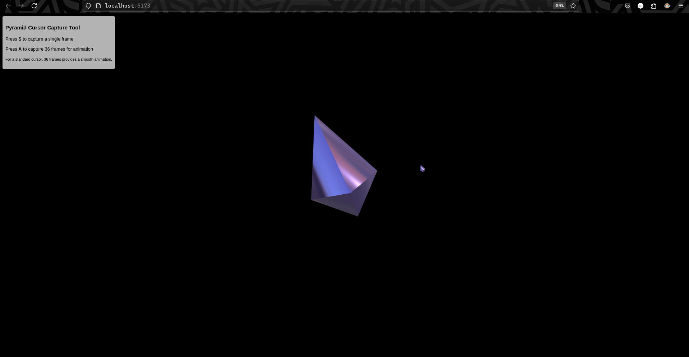

# Crystal

A stunning spinning mouse cursor for your GNOME desktop. Vibe coded in threejs.



## Installation

1. `npx vite` to run and open in your browser

2. Capture frames pressing `s`

3. Create a new folder `Crystal` wherever you like, move all frames to it

4. Create file `crystal.config` in it with the following content:

<details>
<summary>Click to expand configuration content</summary>

```bash
32 9 2 cursor_00.png 150
32 9 2 cursor_01.png 150
32 9 2 cursor_02.png 150
32 9 2 cursor_03.png 150
32 9 2 cursor_04.png 150
32 9 2 cursor_05.png 150
32 9 2 cursor_06.png 150
32 9 2 cursor_07.png 150
32 9 2 cursor_08.png 150
32 9 2 cursor_09.png 150
32 9 2 cursor_10.png 150
32 9 2 cursor_11.png 150
32 9 2 cursor_12.png 150
32 9 2 cursor_13.png 150
32 9 2 cursor_14.png 150
32 9 2 cursor_15.png 150
32 9 2 cursor_16.png 150
32 9 2 cursor_17.png 150
32 9 2 cursor_18.png 150
32 9 2 cursor_19.png 150
32 9 2 cursor_20.png 150
32 9 2 cursor_21.png 150
32 9 2 cursor_22.png 150
32 9 2 cursor_23.png 150
32 9 2 cursor_24.png 150
32 9 2 cursor_25.png 150
32 9 2 cursor_26.png 150
32 9 2 cursor_27.png 150
32 9 2 cursor_28.png 150
32 9 2 cursor_29.png 150
32 9 2 cursor_30.png 150
32 9 2 cursor_31.png 150
32 9 2 cursor_32.png 150
32 9 2 cursor_33.png 150
32 9 2 cursor_34.png 150
32 9 2 cursor_35.png 150
```

</details>

5. Run `xcursorgen crystal.config left_ptr` to generate cursor file
   (Install `xcursorgen` if you don't have it already)

6. Create a new folder `~/.icons/Crystal`, create a `index.theme` file with the following content in it.

```bash
[Icon Theme]
Name=Pyramid
Inherits="Adwaita"
```

7. create a folder `~/.icons/Crystal/cursors`, move the generated cursor file `left_ptr` to it, run

```bash
ln -s left_ptr default
ln -s left_ptr pointer
ln -s left_ptr arrow
ln -s left_ptr top_left_arrow
ln -s left_ptr hand1
ln -s left_ptr hand2
```

8. Finally, select the cursor theme in **GNOME Tweaks** and enjoy!
   (Install `gnome-tweaks` if you don't have it already)
